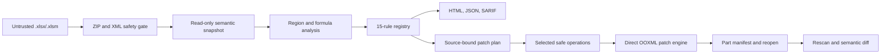

# Architecture

## Trust boundary

Every workbook path enters through `ooxml.safety.inspect_package`. The safety layer validates the
filesystem type and extension, ZIP member/resource limits, XML parser configuration, and internal
relationship resolution before `openpyxl` or a rule sees the file. External relationships are
recorded but never dereferenced.

## Modules

- `models`: strict Pydantic public schemas and enums.
- `ooxml`: package limits, hardened XML parsing, relationship checks, and direct patching.
- `snapshot`: sparse extraction of populated/styled cells and workbook structure.
- `formulas`: non-executing A1 token analysis, R1C1-like signatures, and conservative translation.
- `regions`: connected dense regions and formula bands with bounded gaps.
- `rules`: plugin interface, registry, and the version-2 built-in catalog.
- `repair`: deterministic plans, preconditions, direct XML operations, manifests, and validation.
- `diff`: semantic comparison independent of ZIP serialization.
- `testing`: bounded YAML assertions, not a general formula evaluator.
- `reports`: self-contained HTML/JSON/SARIF serialization.
- `web`: loopback-only FastAPI workflow backed by process-owned temporary storage.
- `demo`: generated defects and end-to-end learning artifact.

## Data flow and invariants

The scanner holds one in-memory `openpyxl` workbook only while rules run, then closes it. Rules may
propose declarative operations but do not write files. Finding and patch IDs are hashes of stable
semantic inputs rather than list positions.

The repair engine checks these invariants:

1. input SHA-256 equals the plan source hash;
2. each target semantic fingerprint equals its precondition;
3. each selected operation is marked safe and has confidence at least 0.95;
4. `.xlsm` is never written;
5. target/source cells do not use unsupported formula modes;
6. changed package parts equal the exact expected part set;
7. unchanged entry contents compare byte-for-byte;
8. output reopens through two readers and matches every requested semantic value;
9. source SHA-256 remains unchanged;
10. a rescan introduces no error- or critical-level finding.

## Resource model

The safety layer performs central-directory checks before decompression and reads XML with a
per-part bound. Snapshot/region logic iterates the sparse cell store rather than trusting an OOXML
dimension such as `A1:XFD1048576`. YAML assertions independently cap expanded ranges at 100,000
cells. Web uploads stream in 1 MiB chunks and stop at the configured compressed-file limit.

## Extension model

`WorkbookRule.run(RuleContext) -> RuleResult` is the public rule interface. A caller can register a
trusted instance directly. Installed packages can expose the `workbooklens.rules` entry-point group,
which is loaded only by an explicit call. This keeps deterministic built-ins available without
implicitly executing arbitrary installed plugin code.
