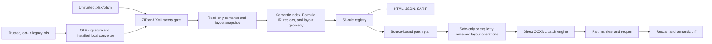

# Architecture

## Trust boundary

Every normal OOXML scan or repair path enters through `ooxml.safety.inspect_package`. The safety
layer validates the filesystem type and extension, ZIP member/resource limits, XML parser
configuration, and internal relationship resolution before `openpyxl` or a rule sees the file.
External relationships are recorded but never dereferenced. Legacy `.xls` conversion is a separate
pre-OOXML trust boundary and accepts only user-designated trusted input: an installed Microsoft Excel
or LibreOffice process opens the workbook and may recalculate formulas or process workbook-defined
behavior before the resulting `.xlsx` enters the normal safety gate.

## Modules

- `models`: strict Pydantic public schemas and enums.
- `ooxml`: package limits, hardened XML parsing, relationship checks, and direct patching.
- `snapshot`: sparse extraction of populated/styled cells and workbook structure.
- `layout`: deterministic text measurement, visual shared-border semantics, content bounds, and
  format-tail discovery without invoking a spreadsheet renderer.
- `formulas`: non-executing A1 token analysis, R1C1-like signatures, conservative translation,
  Formula IR, typed bounded references, and scan-cached dependency-graph analysis for static
  circular references and structural range checks.
- `regions`: connected dense regions and formula bands with bounded gaps.
- `rules`: plugin interface, registry, and the built-in catalog, including profile-aware data
  contracts, report-only formula semantics, and conservative drawing/layout geometry.
- `repair`: deterministic plans, cell/layout preconditions, atomic groups, direct XML operations,
  manifests, and validation.
- `diff`: semantic and layout comparison independent of ZIP serialization.
- `testing`: bounded YAML assertions and optional Workbook Profile validation, not a general formula
  evaluator.
- `reports`: self-contained HTML/JSON/SARIF serialization.
- `conversion`: optional Microsoft Excel or LibreOffice bridge for trusted legacy OLE-based `.xls`
  input; the provider may recalculate formulas or process workbook-defined behavior, and generated
  `.xlsx` files must re-enter through the normal package safety gate.
- `web`: loopback-only FastAPI workflow backed by process-owned temporary storage.
- `demo`: generated defects and end-to-end learning artifact.

## Data flow and invariants

The scanner holds one in-memory `openpyxl` workbook only while rules run, then closes it. Rules may
propose declarative operations but do not write files. The snapshot distinguishes populated-content
bounds from the worksheet's declared dimension and records explicit row heights, column widths, and
saved views. Finding, patch, and atomic-group IDs are hashes of stable semantic inputs rather than
list positions.

New semantic rules record their reasoning boundary in evidence details as `PROVEN_STATIC`,
`STRONG_STRUCTURAL`, or `SEMANTIC_HEURISTIC`. Formula and business-value findings are report-only
unless a deterministic repair is independently justified; none of the Profile or formula-semantic
rules invents a replacement value or formula. Visible-sheet layout and KPI block advisories may
summarize several independently proven cell findings, but they remain `INFO`, carry no patch, and
explicitly leave evidence-insufficient cells unclassified.

An optional version-2 YAML Workbook Profile adds user-owned semantics such as required fields,
enumerations, contact roles, fixed-width identifiers, and currency/percentage/date roles. The
Profile is parsed into bounded sheet and column contracts before rules run. Without a Profile,
semantic inference remains conservative and skips constraints such as allowed-value sets that
cannot be established from workbook structure alone.

The repair engine checks these invariants:

1. input SHA-256 equals the plan source hash;
2. each target semantic fingerprint equals its precondition;
3. every selected operation has confidence at least 0.95 and is either safe-only eligible or an
   explicitly accepted `layout_review` operation;
4. `--safe-only` excludes every layout-changing operation, and layout consent never authorizes a
   different unsafe risk class;
5. each atomic group is selected and applied in full;
6. target/source cell fingerprints and applicable row, column, view, or exact-tail fingerprints
   still match;
7. `.xlsm` is never written;
8. target/source cells do not use unsupported formula modes;
9. changed package parts equal the exact expected part set;
10. unchanged entry contents compare byte-for-byte;
11. output reopens through two readers and matches every requested semantic or layout value;
12. source SHA-256 remains unchanged;
13. a rescan introduces no error- or critical-level finding.

## Resource model

The safety layer performs central-directory checks before decompression and reads XML with a
per-part bound. Snapshot, region, and layout logic iterate the sparse cell store rather than trusting
an OOXML dimension such as `A1:XFD1048576`. Format-tail cleanup authorizes bounded exact cell and row
lists, then rejects intersections with formulas, names, tables, validations, comments, hyperlinks,
page breaks, drawings, or unsupported row metadata. YAML assertions independently cap expanded
ranges at 100,000 cells; optional Profile table bounds are capped at 1,000,000 cells. Web uploads
stream in 1 MiB chunks and stop at the configured compressed-file limit. Legacy conversion uses the
same request limit, a bounded provider timeout, a process-owned temporary directory, and the normal
output package limits. Download completion removes the conversion directory; lifespan cleanup
remains the fallback after disconnects or failures.

## Extension model

`WorkbookRule.run(RuleContext) -> RuleResult` is the public rule interface. A caller can register a
trusted instance directly. Installed packages can expose the `workbooklens.rules` entry-point group,
which is loaded only by an explicit call. This keeps deterministic built-ins available without
implicitly executing arbitrary installed plugin code.
